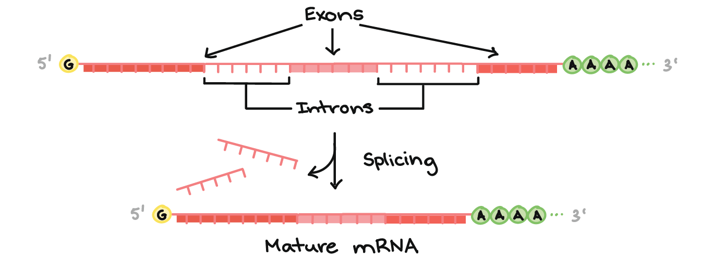

# <i> a simple</i> Hidden Markov Model <i>toy</i>

_HMM implemented from scratch for a simplified 5′ splice-site recognition problem, a decoding problem._  
This is my implementation to the problem described in ["What is a hidden Markov model?" by Sean Eddy (2004) published in _Nature biotechnology_](https://www.nature.com/articles/nbt1004-1315) [[1](#references)] in an attempt to understand the concept of _Hidden Markov Models_ and the _Viterbi algorithm_.

$"\ But\ \ we\ \ can't\ \ know\ \ better\ \ until\ \ knowing\ \ better\ \ is\ \ useless\ " - John\ \ Green$


## Background 

**Some biology:**   
Splicing is a process in which introns are removed from the pre-mRNA and exons are joined together to form the mature mRNA (when forming a functional product of a gene, exons=good & introns=bad - the molecular machinery get rid of introns and concatenates exons as blueprint for the exact protein sequence to be translated). The 5' splice site is the boundary between the exon and the intron at the 5' end of the intron. It is a sequence of nucleotides that signals the spliceosome (in eukarya) to cut the RNA at that location. 

<p align='center'>

</p>
<p align='center'><i>from khanacademy.org</i></p>

This _5' splice-site recognition problem_ is a simplified version of the problem of identifying the boundaries of exons and introns in a gene. The problem is to predict the location of the 5' splice site in a sequence of nucleotides. 

<p align='center'></p>

***The computational model:***  
A Hidden Markov Model (HMM) is a probabilistic model that describes a sequence of observable events generated by a sequence of hidden states. It is widely used in bioinformatics for sequence analysis. For the sake of this problem, the observable events are the actually accessible data (nucleotides in the sequence: A, T, C, G) and the hidden states are the states that generate the observable events (exon, intron, 5' splice site).

<p align='center'>
<!-- <figure align='center'> -->
  
<p>
<p align='center'>Figure 1: "A toy HMM for 5′ splice site recognition" [1]. These parameters will be used in the implementation. </p>


Starting by defining initial HMM terms for this problem:  
- **Hidden States:** $S=\set {S_E, S_5, S_I}$   
set of hidden states where $E$ is the exon state, $5$ is the 5' splice site state, and $I$ is the intron state.
- **Observables:** $O=\set {O_A, O_C, O_G, O_T}$  
set of observable states, in this case the nucleotides 
- **Initial probabilities:** $\pi = \set {\pi_E, \pi_5, \pi_I}=\set{1,0,0}$    
Initial probabilities of being in each state starting from the state at $time=0$. In this problem, the nucleotide sequence always starts with an exon; ___note, the sum of all initial probabilities must be 1___
- **Transition probabilities:** $A=\set{a_{Si \rightarrow Sj}}$  
Matrix that contains the probabilities of transitioning from state $S_i$ to state $S_j$. In this problem, the transition probabilities between the 3 states $S_E$, $S_5$, $S_I$ should be a $3*3$ matrix as follows: 

<div align="center">

| $a_{Si \rightarrow Sj}$ | $S_E$ | $S_5$ | $S_I$ |
|--------------------------|-------|-------|-------|
| $S_E$                      | 0.9   | 0.1   | 0     |
| $S_5$                      | 0     | 0     | 1     |
| $S_I$                      | 0   | 0     | 1   |

<i>note, instead of a 0.1 probability to end after intron, this was edited to have a probability of 1 to have an intron after it, and terminating right after the sequence of observables (nucleotides) finishes at the end of the sequence</i>
</div>

- **Emission probabilities:** $E=\set{e_{(o/s)}}$  
Matrix that contains the probabilities of emitting an observable $o$ from a hidden state $s$. In other words, probability of observing a nucleotide given an exon/intron/5' hidden state. In this problem, the emission probabilities should be a $3*4$ matrix as follows:

<div align="center">

| $e{(o/s)}$ | $O_A$ | $O_C$ | $O_G$ | $O_T$ |
|------------|-----|-----|-----|-----|
| $S_E$        | 0.25 | 0.25 | 0.25 | 0.25 |
| $S_5$        | 0.05 | 0 | 0.95 | 0 |
| $S_I$        | 0.4 | 0.1 | 0.1 | 0.4 |

</div>

A sequence of observables (nucleotides here) of lenfth T can be perceirved in a __lattice__ where each column represents a time step and each row represents a hidden state. Each edge in this lattice represents a transition between hidden states and each node represents an observable state. Thus the probability at each node can be calculated by the product of the emission probability and the transition probability from the previous state.

<p align='center'>
</p>


The purpose of the HMM - as in the described problem - is to predict the most likely sequence of hidden states given a sequence of observable states. In other words, given a sequence of nucleotides, the HMM will predict the most likely sequence of exon, intron, and 5' splice site states, which will help to identify the 5' splice site in the sequence.  
This is a classic problem addressed by HMMs called the ___Decoding Problem___. To solve it the ***Virtebri*** **algorithm** is often used.  

***What's the Viterbi algorithm?***

It's a _dynamic programming_ algorithm, aiming to get the best possible sequence of hidden states that generated the observed sequence. It does so by calculating the probability of the most likely path that ends in each state at each time step.  
The DP algorithm is based on the **principle of optimality:** the best path to a state at time $t$ is the best path to that state at time $t-1$ plus the transition probability from the previous state to the current state and the probability of emitting the observed state from the current state. The algorithm calclates the probability of the most likely path to each state at each time step and then _backtracks_ to find the most likely sequence of hidden states that generated the observed sequence.


This problem is a very particular case of the decoding problem where there exists _forbidden transitions_ between states, _e.g., the 5' splice site cannot be followed by an exon_. This simplifies the problem and makes it easier to solve, forming this sparse lattice:

<p align='center'>
</p>

This will also affect the _initiation_ and _termination_ steps of the algorithms. 
In any case, the algotiyhm's implementation in [`HMM.py`](./src/HMM.py) will be able to solve the general decoding problem as well as the special case of the 5' splice site recognition problem.

Other problems solved by HMMs include the _Likelihood (Evaluation)_ and _Learning_ problems. The likelihood problem is about calculating the probability of observing a sequence of observable states given the model parameters - this one uses the forward-backward algorithms. The learning problem is about estimating the model parameters given a sequence of observable states.

## Implementation

The algorithm is implemented in [`HMM.py`](./src/HMM.py) and tested in [`main.py`](./src/main.py). The implementation is based on the Viterbi algorithm and the HMM parameters described above. The implementation is tested on a simple example (same one as in the figure) of a sequence of nucleotides and the expected output is the most likely sequence of hidden states that generated the observed sequence.

A model is defined by:  
- number of hidden states
- number of observable states
- initial probabilities
- transition probabilities
- emission probabilities
lambda = (A, E, pi) (paramters of the model)

The Viterbi algorithm is ran given lambda and a sequnece of observables as per the following pseudocode:

$Viterbi$($\lambda$, $O$):
  
1. $A, E, \pi \leftarrow \lambda$
2. $T \leftarrow$ length of $O$
3. $N \leftarrow$ length of $A$
4. Initialize $\delta$ and $\psi$ matrices of size $N*T$
5. Initialize $\delta_{1,i} = \pi_i * e_{(O_1/S_i)}$ for $i=1,2,...,N$
6. for $t=2$ to $T$:
7. $\quad$ for $j=1$ to $N$:
8. $\quad \quad \delta_{t,j} = max_{i=1}^{N}(\delta_{t-1,i} * a_{(S_i/S_j)} * e_{(O_t/S_j)})$
9. $\quad \quad \psi_{t,j} = argmax_{i=1}^{N}(\delta_{t-1,i} * a_{(S_i/S_j)} * e_{(O_t/S_j)})$
10. Backtrack to find the most likely sequence of hidden states

The memoization of the $\delta$ matrix must look like teh following: 


| | C | T | T | C| A |
|-|---|---|---|---|---|
|E | $\pi_E * e_{(C/E)}$ | $\leftarrow \mathbf{max \delta_i1 * a_{(E/E)} * e_{(T/E)}}$ | $\leftarrow \mathbf{max \delta_i2 * a_{(E/E)} * e_{(T/E)}}$ | $\leftarrow \mathbf{max \delta_i3  * a_{(E/E)} * e_{(C/E)}}$ | $\leftarrow \mathbf{max \delta_i4 * a_{(E/E)} * e_{(A/E)}}$ |
|5 | $\pi_5 * e_{(C/5)}$ | $\nwarrow max \delta_i1 * a_{(E/5)} * e_{(T/5)}$ | $\nwarrow max \delta_i2 * a_{(5/5)} * e_{(T/5)}$ | $\nwarrow max \delta_i3  * a_{(I/5)} * e_{(C/5)}$ |  $\nwarrow max \delta_i4 * a_{(I/5)} * e_{(A/5)}$ |
|I | $\pi_I * e_{(C/I)}$ | $\nwarrow max \delta_i1 * a_{(E/I)} * e_{(T/I)}$ | $\nwarrow max \delta_i2 * a_{(5/I)} * e_{(T/I)}$ | $\nwarrow max \delta_i3  * a_{(I/I)} * e_{(C/I)}$ |  $ \nwarrow max \delta_i4 * a_{(I/I)} * e_{(A/I)}$ |


Running the example:
```python
python src/main.py
```
Output:
```text
EEEEEEEEEEEEEEEEE5IIIIIII
CTTCATGTGAAGCAGACGTAAGTCA
```

_p.s. it is recommended to do a log transformation of the probabilities to avoid underflow when dealing with very small probabilities, mind that the product of probabilties will be transdormed into a sum of log probabilities_

## References

[1] Eddy, S. R. (2004). What is a hidden Markov model?. Nature biotechnology, 22(10), 1315-1316.
