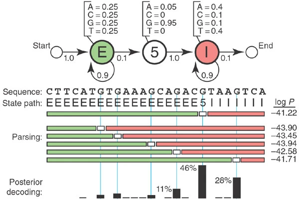

# Hidden Markov Model <i>toy</i>

_HMM implemented from scratch for a simplified 5′ splice-site recognition problem._  
This is my implementation to the problem described in ["What is a hidden Markov model?" by Sean Eddy (2004) published in _Nature biotechnology_](https://www.nature.com/articles/nbt1004-1315) [[1](#references)].

$"\ But\ \ we\ \ can't\ \ know\ \ better\ \ until\ \ knowing\ \ better\ \ is\ \ useless\ " - John\ \ Green$

## Background 

**Some biology:** 
Splicing is a process in which introns are removed from the pre-mRNA and exons are joined together to form the mature mRNA (when forming a functional product of a gene, exons=good & introns=bad - the molecular machinery get rid of introns and concatenates exons as blueprint for the exact protein sequence to be translated). The 5' splice site is the boundary between the exon and the intron at the 5' end of the intron. It is a sequence of nucleotides that signals the spliceosome (in eukarya) to cut the RNA at that location. 

This _5' splice-site recognition problem_ is a simplified version of the problem of identifying the boundaries of exons and introns in a gene. The problem is to predict the location of the 5' splice site in a sequence of nucleotides. 

A Hidden Markov Model (HMM) is a probabilistic model that describes a sequence of observable events generated by a sequence of hidden states. It is widely used in bioinformatics for sequence analysis. 

<figure align='center'>
  
  <figcaption>Figure 1: "A toy HMM for 5′ splice site recognition" [1]. These parameters will be used in the implementation. </figcaption>
</figure>

Starting by defining initial HMM terms for this problem:  
- **Hidden States:** $S=\set {S_E, S_5, S_I}$  
set of hidden states where $E$ is the exon state, $5$ is the 5' splice site state, and $I$ is the intron state.
- **Observables:** $O=\set {O_A, O_C, O_G, O_T}$
set of observable states, in this case the nucleotides 
- **Initial probabilities:** $\pi = \set {\pi_E, \pi_5, \pi_I}=\set{1,0,0}$  
Initial probabilities of being in each state starting from the state at $time=0$. In this problem, the nucleotide sequence always starts with an exon; ___note, the sum of all initial probabilities must be 1___
- **Transition probabilities:** $A=\set{a_{Si \rightarrow Sj}}$
Matrix that contains the probabilities of transitioning from state $S_i$ to state $S_j$. In this problem, the transition probabilities between the 5 states $S_{start}$, $S_E$, $S_5$, $S_I$, and $S_{end}$ should be a $5*5$ matrix as follows: 

| $a_{Si \rightarrow Sj}$ | $S_{start}$ | $S_E$ | $S_5$ | $S_I$ | $S_{end}$ |
|--------------------------|-------------|-------|-------|-------|----------|
| $S_{start}$              | 0           | 1     | 0     | 0     | 0        |
| $S_E$                    | 0           | 0.9   | 0.1   | 0     | 0        |
| $S_5$                    | 0           | 0     | 0   | 1   | 0        |
| $S_I$                    | 0           | 0   | 0     | 0.9   | 0.1        |
| $S_{end}$                | 0           | 0     | 0     | 0     | 0        |
<!-- <i>note, instead of a 0.1 probability to end after intron, this was edited to have an exon at the end of the sequence</i> -->

- **Emission probabilities:** $E=\set{e_{(o/s)}}$  
Matrix that contains the probabilities of emitting an observable $o$ from a hidden state $s$. In other words, probability of observing a nucleotide given an exon/intron/5' hidden state. In this problem, the emission probabilities should be a $3*4$ matrix as follows:

| $e{(o/s)}$ | $O_A$ | $O_C$ | $O_G$ | $O_T$ |
|------------|-----|-----|-----|-----|
| $S_E$        | 0.25 | 0.25 | 0.25 | 0.25 |
| $S_5$        | 0.05 | 0 | 0.95 | 0 |
| $S_I$        | 0.4 | 0.1 | 0.1 | 0.4 |

The purpose of the HMM is to predict the most likely sequence of hidden states given a sequence of observable states. In other words, given a sequence of nucleotides, the HMM will predict the most likely sequence of exon, intron, and 5' splice site states, which will help to identify the 5' splice site in the sequence.

## References

[1] Eddy, S. R. (2004). What is a hidden Markov model?. Nature biotechnology, 22(10), 1315-1316.
